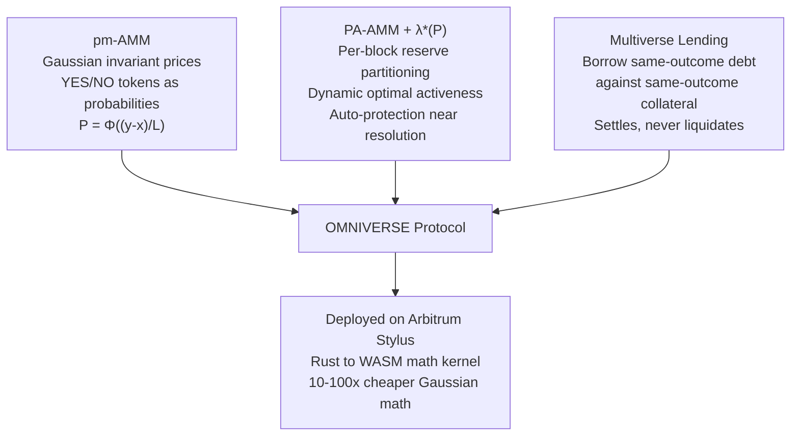
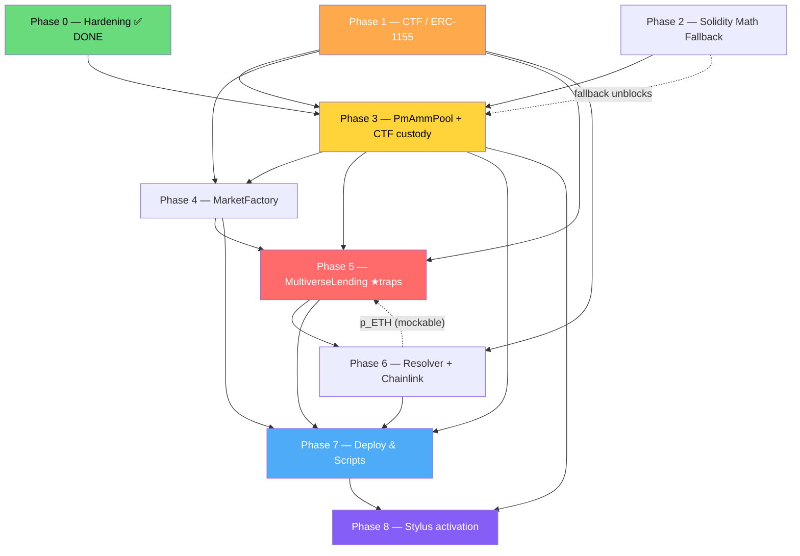

# OMNIVERSE — Deep Dive & Remaining Work

> Backend-focused deep dive and build roadmap. Outcome-token standard: **Gnosis CTF (ERC-1155)**.
> Frontend is deferred (a short "what it'll need" note is at the end).
> Verified against the live repo on 2026-06-04 — Phase 0 (all review fixes) is **done and green**.
> Companion docs: `CONTEXT.md`, `IMPLEMENTATION_PLAN.md`, `GAUSSIAN_LAMBDA_STAR.md`, `REVIEW_AND_NEXT_STEPS.md`.

---

## What Is This Project?

OMNIVERSE is a **prediction market DeFi protocol** on **Arbitrum Stylus** that fuses three research primitives:



### The 12-Word Pitch
> *"Trade probability curves and borrow with zero liquidation risk — no trusted coordinator."*

### Three Key Innovations
| Innovation | What It Does | Why It Matters |
|---|---|---|
| **pm-AMM** | Prices binary YES/NO tokens using `P = Φ((y-x)/L)` | Closed-form probability pricing, no oracle needed |
| **PA-AMM λ\*(P)** | Splits reserves into active/passive each block; dynamic λ\* auto-shrinks at resolution | LP losses bounded; protection exactly when most needed |
| **Multiverse Lending** | Borrow YES-USDC against YES-ETH collateral | Both sides resolve to 0 simultaneously → **zero liquidation** |

> **Pitch honesty (from `GAUSSIAN_LAMBDA_STAR.md`):** claim the **exact AR(1) z-dynamics** and the `v(z)`/`φ(z)`
> identities as *proven*; frame the specific `γ_G` weighting and the λ\*(P) numbers as a *novel construction,
> not a theorem*. The λ\*(P) curve is **W-shaped** (peaks at P≈0.2/0.8, dip at 0.5), not a dome.

---

## Architecture Overview

```
┌──────────────────────────────────────────────────────────────────────┐
│                        FRONTEND (deferred)                            │
│  Next.js 15 + wagmi v2 + viem + RainbowKit + Recharts + Framer        │
│  Trade/LP/Lending panels + 3 Demos                                    │
└──────┬───────────────────────────────────────────┬───────────────────┘
       │ viem reads/writes (poll 2s)                │ GraphQL (Ponder)
       ▼                                            ▼
┌──────────────────────────────────────┐  ┌────────────────────────────┐
│       ARBITRUM SEPOLIA (chain)        │  │  Ponder Indexer (not started)│
│                                       │  │  OmniverseTrade (9-field)    │
│  MarketFactory ─► PmAmmPool ─► IOmniverseMath ─► OmniverseMath (Stylus)│
│  (not started)    (scaffold,    (frozen iface)   ✅ Rust→WASM, 20.7KB  │
│                    needs custody)                                      │
│        │                  ▲ holds ERC-1155 YES/NO positions            │
│        ▼                  │                                            │
│  MultiverseLending ─► Gnosis CTF ConditionalTokens (ERC-1155, external)│
│  (not started)         deploy our own audited artifact on Arb Sepolia  │
│        │                positionIds for YES/NO per collateral universe │
│        ▼                                                               │
│  Resolver ─► Chainlink ETH/USD (within-universe price, fail-closed)    │
│  (not started)                                                         │
└──────────────────────────────────────────────────────────────────────┘
```

**Contract stack:**

| Contract | Language | Status | Purpose |
|---|---|---|---|
| `OmniverseMath` | Rust→WASM (Stylus) | ✅ done | Stateless Gaussian math: `phi/Phi/PhiInv/solveSwap/poolValue/lambdaStarGaussian` |
| `PmAmmPool` | Solidity | 🟡 scaffold (hardened) | Reserves, PA-AMM partition, `L_t` decay, swaps — **no real token custody yet** |
| `ConditionalTokens` (Gnosis CTF) | Solidity 0.5.x | ⬜ external | ERC-1155 YES/NO outcome positions; deploy the audited artifact |
| `MarketFactory` | Solidity | ⬜ not started | Provisions condition + two collateral universes + pools |
| `MultiverseLending` | Solidity | ⬜ not started | Same-outcome deposit/borrow; settle-never-liquidate |
| `Resolver` | Solidity | ⬜ not started | Owner-resolve (MVP) → CTF `reportPayouts` |

---

## What's Been Built (✅ Done & verified)

### 1. Stylus Math Kernel — `contracts-stylus/`

The crown jewel: a stateless Rust/WASM contract holding all the heavy Gaussian math.

| File | What It Does | Status |
|---|---|---|
| `src/lib.rs` | Entry point, 6 ABI functions via `#[public]` | ✅ |
| `src/wad.rs` | WAD (1e18) fixed-point: mul, div, abs, conversions | ✅ |
| `src/math/sqrt.rs` | MSB + Babylonian sqrt (7 Newton iterations) | ✅ |
| `src/math/exp.rs` | PRBMath-style exp2 (64 magic constants), exp, log2, ln | ✅ |
| `src/math/gaussian.rs` | φ(z) PDF, Φ(z) CDF (A&S 26.2.17), Φ⁻¹(p) (Acklam + Halley) | ✅ |
| `src/math/solver.rs` | Newton+bisection swap solver for the pm-AMM invariant | ✅ (H-1/M-1 fixed) |
| `src/math/lambda.rs` | `v(z)` pool value, `λ*(γ', P)` dynamic optimal activeness | ✅ (M-2 fixed) |
| `tests/math_tests.rs` | Comprehensive host tests | ✅ **40 passing** |

**Key facts (verified):**
- **Zero floating-point** — all I256/U256 integer arithmetic (mandatory for Stylus activation).
- **`cargo stylus check` passes** (cargo-stylus v0.10.7 installed): contract **20.7 KB**, under the 24 KB limit, float-free. Only the *activation* step is pending a live RPC node (`ConnectionRefused` at `localhost:8547`, expected).
- Build profile: `opt-level = "z"`, LTO, `panic = "abort"`, strip.

### 2. Solidity Pool Scaffold — `contracts-sol/`

| File | What It Does | Status |
|---|---|---|
| `src/interfaces/IOmniverseMath.sol` | Frozen interface matching Stylus selectors (case-sensitive `Phi`/`PhiInv`) | ✅ |
| `src/PmAmmPool.sol` | Reserve accounting, buyYes/buyNo, PA-AMM rebalance, dynamic/static λ, hardened | ✅ scaffold (no real tokens) |
| `test/mocks/MockOmniverseMath.sol` | On-curve mock (returns invariant-consistent values) | ✅ |
| `test/PmAmmPool.t.sol` | Foundry tests | ✅ **11 passing** |

### 3. Documentation
`CONTEXT.md` (AI-agent context), `IMPLEMENTATION_PLAN.md` (full build plan), `REVIEW_AND_NEXT_STEPS.md`
(review + 2-person split + fix log), `GAUSSIAN_LAMBDA_STAR.md` (λ\* derivation), `claude.md` (coding guidelines).

> **Git state:** all Phase-0 fixes are in the **working tree, uncommitted** (HEAD is still the scaffold commit
> `07ac39e`). First action below is to commit them so the second dev picks them up.

---

## Phase 0 — Hardening (✅ Complete)

Every finding from `REVIEW_AND_NEXT_STEPS.md` is fixed, tested, and present in the code. Kept here as a record.

| ID | Area | What it was | Fix shipped |
|---|---|---|---|
| **H-1** | `solver.rs` | Upper bracket `x1+y0+ell` excluded the root → ~4% panic on large sells | `hi = x1 + 5*ell` + large-sell regression test |
| **H-2** | `PmAmmPool.sol` | `L_t` used raw seconds → first rebalance rescaled price curve ~800× | `duration` immutable; `L_t = L0·√((T−t)/duration)` (WAD); `currentLiquidity()` + decay test |
| **M-1** | `solver.rs` | `MAX_ITER=40` + abs `EPSILON` could spuriously panic at scale | `MAX_ITER=100` + bracket-collapse exit (`|hi−lo|≤1 → return hi`) |
| **M-2** | `lambda.rs` | `gamma_prime*WAD` could overflow | `assert!(gamma_prime <= 1e24)` |
| **M-3** | `PmAmmPool.sol` | No freeze window near T → numerics blow up | `FREEZE_WINDOW=1h` + `Frozen()` on buyYes/buyNo |
| **M-4** | `PmAmmPool.sol` | No post-swap invariant guard | **invariant-RESIDUAL** assertion `\|f\|≤1e9` → `InvariantViolation()` |
| **M-5** | `PmAmmPool.sol` | No slippage protection | `minOut` param + `Slippage()` on both swaps |
| **M-6** | `PmAmmPool.sol` | No reentrancy guard for upcoming custody | minimal `nonReentrant` on buyYes/buyNo/rebalance (groundwork) |
| **L-1..L-4, CLEANUP-1** | both | Stale comment, opaque unwraps, double Phi call, double-floor, rambling comments | all tidied |
| **DOC** | `CONTEXT.md` + contract | `OmniverseTrade` defined 3 ways; wrong WASM size claim | frozen to canonical **9-field** event (buyNo side=2); size claim corrected |

> **M-4 note (important):** implemented as the **invariant residual** `f = (y−x)·Φ(z) + ℓ·φ(z) − y`, reverting
> when `|f| > INVARIANT_EPS (1e9)` — **not** the "`poolValue` non-decreasing" check the original review text
> suggested. `v(z)` is U-shaped (min at z=0), so a non-decreasing-poolValue assertion would wrongly reject valid
> swaps that move price toward 0.5. The residual is the sound, spec-aligned guard. Re-validate `INVARIANT_EPS`
> against the live kernel in Phase 8 (recomputation flooring may need slight loosening).

**Verification:** `cargo test` → 40 passed · `forge test` → 11 passed · `cargo stylus check` → 20.7 KB, float-free.

---

## Gnosis CTF (ERC-1155) Integration Reference

The chosen outcome-token substrate. Facts verified against `gnosis/conditional-tokens-contracts`
(`CTHelpers.sol`, `ConditionalTokens.sol`), the developer guide, Polymarket's CTF docs, and the ChainSecurity
2024 audit.

### The contract & package
- `@gnosis.pm/conditional-tokens-contracts` **v1.0.3** (Truffle; `npm i` gives source + compiled artifacts).
- **It IS ERC-1155** — `ConditionalTokens` extends `ERC1155`; each outcome position is an ERC-1155 token whose id is a `positionId`.
- **`pragma solidity ^0.5.1`** — the load-bearing caveat.
- **Audited:** Gnosis (2019) + **ChainSecurity (11 Apr 2024)** commissioned by Polymarket (focus: correctness + the elliptic-curve crypto in `getCollectionId`).

> [!IMPORTANT]
> **Do NOT recompile CTF to 0.8.x or port it to Stylus.** That would ship unaudited bytecode and risk diverging
> from the canonical id math. Treat CTF as **external infra**: deploy the prebuilt **audited artifact** and
> interact only through an `IConditionalTokens` interface + `IERC1155Receiver`. The CTF address is a config/
> constructor param. This keeps the fragile EC collection-id derivation exactly as audited.

### Deployment on Arbitrum Sepolia
- **No confirmed official CTF deployment on Arb Sepolia.** The canonical live instance is Polygon mainnet
  `0x4D97DCd97eC945f40cF65F87097ACe5EA0476045` (Polymarket; Polygon-only).
- **Recommended path:** deploy **our own instance of the audited v1.0.3 bytecode** to Arb Sepolia. CTF is
  permissionless, admin-keyless infra — anyone can `prepareCondition`. Record the resulting address in
  `deployments/arb-sepolia.json`. *(Uncertain on an "official" address — assume none and deploy our own.)*

### Core primitives (signatures & semantics)
Resolution state lives in `payoutNumerators[conditionId]` (uint[] sized to `outcomeSlotCount`) and
`payoutDenominator[conditionId]` (0 until resolved).

```solidity
prepareCondition(address oracle, bytes32 questionId, uint outcomeSlotCount)
// Registers a condition (we use outcomeSlotCount = 2). conditionId = getConditionId(oracle, questionId, 2).
// Callable by anyone. Mints nothing.

splitPosition(IERC20 collateral, bytes32 parentCollectionId, bytes32 conditionId, uint[] partition, uint amount)
// With parent=0x0, partition=[1,2]: pulls `amount` collateral via transferFrom (approve first),
// _batchMints `amount` of YES and `amount` of NO to msg.sender.

mergePositions(IERC20 collateral, bytes32 parent, bytes32 conditionId, uint[] partition, uint amount)
// Reverse of split: burns equal YES+NO, returns `amount` collateral (parent==0).

redeemPositions(IERC20 collateral, bytes32 parent, bytes32 conditionId, uint[] indexSets)
// Post-resolution only. payout = balance * (Σ payoutNumerators[bits in indexSet]) / payoutDenominator.
// Burns redeemed positions, transfers collateral out.

reportPayouts(bytes32 questionId, uint[] payouts)
// The oracle/resolver call. conditionId is derived from msg.sender, so ONLY the address named as `oracle`
// in prepareCondition can resolve. Binary: [1,0] = slot 0 wins, [0,1] = slot 1 wins.
```

### ID derivation — the part people get wrong
```solidity
getConditionId(oracle, questionId, slots) = keccak256(oracle, questionId, slots);          // simple hash
getPositionId(collateral, collectionId)   = uint(keccak256(collateral, collectionId));      // simple hash → ERC1155 id
getCollectionId(parent, conditionId, indexSet)  // NOT a hash — maps keccak onto alt_bn128 and does EC point add
```
> [!CAUTION]
> **`getCollectionId` is elliptic-curve math, not a hash.** Never compute a collectionId by hand. We always pass
> `parentCollectionId = bytes32(0)` (no nesting, no point addition), but the curve mapping still applies. Safest:
> **read the four positionIds from the contract once at setup and cache them.**

**Binary YES/NO (our convention — lock it in config, never flip):**
- partition `[1, 2]`; indexSet `1 = 0b01 = slot 0 = YES`, indexSet `2 = 0b10 = slot 1 = NO`.
- `yesPositionId = getPositionId(collateral, getCollectionId(0, conditionId, 1))`
- `noPositionId  = getPositionId(collateral, getCollectionId(0, conditionId, 2))`

### Custody requirements (PmAmmPool & MultiverseLending)
- Implement **`IERC1155Receiver`** (`onERC1155Received` → `0xf23a6e61`, `onERC1155BatchReceived` → `0xbc197c81`)
  + `supportsInterface`/ERC-165. `splitPosition` uses `_batchMint`, which fires `onERC1155BatchReceived` on a
  contract recipient — **without the receiver, splits/transfers into our contracts revert.**
- Call **`setApprovalForAll(ctf, true)`** so our contract can move/merge/redeem positions it custodies; use
  `safeTransferFrom`/`safeBatchTransferFrom`.
- **Reentrancy:** the receive hooks hand control to the recipient mid-transfer — a reentrancy surface. Every
  function that sends/receives positions must be `nonReentrant` with **checks-effects-interactions** (update
  internal accounting *before* the transfer that triggers the callback). This is our responsibility, not CTF's.

### Two-collateral-universe design (confirmed supported)
One shared `conditionId` (same oracle, questionId, slots=2) across a **WETH universe** (YES-WETH/NO-WETH) and a
**USDC universe** (YES-USDC/NO-USDC). `getConditionId` ignores collateral → both universes share the conditionId
and the same payout vector. `getPositionId` includes the collateral address → **four distinct positionIds**, all
resolved by a single `reportPayouts`. Gotchas: derive the conditionId once and reuse it in both universes; a
YES-WETH token redeems to WETH, YES-USDC to USDC (not fungible across universes though they resolve together);
apply the 1=YES/2=NO convention identically in both.

### The non-obvious lending trap (seed the debt reserve correctly)
The borrowable debt reserve must be seeded with the **CTF YES-USDC *position*** (obtained by `splitPosition`-ing
USDC through the CTF), **not raw USDC**. In CTF terms: splitting USDC locks it in the CTF and yields YES-USDC +
NO-USDC, each 1:1 collateralized. If the reserve held raw USDC, that collateral sits outside the conditional
system and the **NO universe can end up under-collateralized** at resolution. Seeding as the YES-USDC position
keeps lending in *position space*, so the split invariant (YES+NO = 1 locked collateral) always holds and the NO
universe stays solvent.

---

## Remaining Backend Work — Phases 1–8

Each phase lists **Goal · Deliverables · Dependencies · Acceptance**. CTF mechanics above feed Phases 1, 3, 4, 5.

### Phase 1 — Gnosis CTF Integration (ERC-1155 substrate)
- **Goal:** stand up the canonical outcome layer so everything downstream speaks ERC-1155 positionIds.
- **Deliverables:** deploy the audited CTF v1.0.3 artifact (don't recompile); `src/interfaces/IConditionalTokens.sol`;
  `src/libraries/CtfIds.sol` (wrap `getConditionId`/`getCollectionId`/`getPositionId`, binary partition `[1,2]`,
  1=YES/2=NO); a reusable `ERC1155Holder` (receiver hooks). Cache the four positionIds at setup.
- **Dependencies:** none on our code (OZ ERC-1155 + a deployed CTF). Runs parallel to Phase 2.
- **Acceptance:** `split(USDC,0x0,conditionId,[1,2],amt)` → `balanceOf(yesId)==amt && balanceOf(noId)==amt`,
  burns `amt` USDC; **conservation:** split→merge round-trips to exact collateral; positionId reproduced by a
  pure recompute; holder accepts single + batch transfers.

### Phase 2 — Solidity Math Fallback (`OmniverseMathSolidity`)
- **Goal:** a hot-swappable EVM impl behind the same `IOmniverseMath` so the whole stack builds/tests before
  Stylus is live and the demo never hard-depends on the WASM toolchain.
- **Deliverables:** `src/math/OmniverseMathSolidity.sol` (all 6 selectors). **AGPL gate:** `solstat` is AGPL-3.0 —
  **recommend reimplementing Φ via A&S 26.2.17 directly** (5 mults) + PRBMath for exp/ln/sqrt, avoiding the AGPL
  landmine. `test/MathParity.t.sol` cross-checking Solidity vs the Rust reference grid.
- **Dependencies:** `IOmniverseMath` (done). Independent of CTF — fully parallel to Phase 1.
- **Acceptance:** λ\* parity (γ'=2: 0.5→0.427, 0.2→0.479, 0.001→0.134 within 1e-4, W-shape); `Φ(0)=0.5`,
  `Φ(1.96)≈0.975`, `φ(0)≈0.3989`; `PhiInv∘Phi` round-trip `|err|<1e-9`; `solveSwap` pool-favoring UP, matches the
  H-1 large-sell case, reverts on forced non-convergence.

### Phase 3 — `PmAmmPool` with real ERC-1155 CTF custody
- **Goal:** turn the virtual-reserve scaffold into a pool that actually holds/moves CTF YES/NO positions while
  preserving every Phase-0 safety property.
- **Deliverables:** inherit `ERC1155Holder`; store `ctf, yesPositionId, noPositionId, collateralToken`. Pull input
  position, update reserves (effects), then transfer output position (interaction) — `nonReentrant` + CEI.
  Internal reserves remain the pricing source of truth (never price off live `balanceOf` — donation-safe);
  reconcile balances only in an invariant assertion. `addLiquidity`/`removeLiquidity` on matched full sets
  (must not move z). Wire `sellYes`/`sellNo` (event side codes 1/3).
- **Dependencies:** Phase 1 (positionIds, holder, interface) + Phase 2 (real math so tests run without Stylus).
- **Acceptance:** **H-1** large-sell doesn't revert against the *real* math (not the trivial mock); **H-2**
  `ellActive ≈ L0` after first cross-block rebalance (not ×1609); balance conservation across swaps; rebalance
  once/block; `currentPrice()==Φ(z)`; residual `|f|≤INVARIANT_EPS`; freeze in final hour; `minOut` enforced;
  no-drain under adversarial fuzz; receiver accepts matched-set deposits, rejects unsolicited ids.

### Phase 4 — `MarketFactory`
- **Goal:** one call provisions a full event: CTF condition + two collateral universes + a pool per tradeable universe.
- **Deliverables:** `createEvent(question, T, resolver, L0, gammaPrime, useDynamicLambda)` →
  `prepareCondition(resolver, questionId, 2)` → for each of `{WETH, USDC}` compute YES/NO positionIds and deploy a
  `PmAmmPool` wired to `(math, ctf, yesId, noId, collateral)` → register in `marketsOfCondition[conditionId]` +
  `markets[]`. `getMarkets()`/`getMarket(id)`. **MVP: one pre-seeded event** (WETH = tradeable/LP pool, USDC =
  lending debt universe, both under one conditionId).
- **Dependencies:** Phase 1 (CTF) + Phase 3 (pool constructor with custody).
- **Acceptance:** exactly one `conditionId` shared by both universes (`poolWETH.conditionId == poolUSDC.conditionId`);
  positionIds recompute correctly; `marketsOfCondition[conditionId].length == 2`; duplicate `createEvent` handled.

### Phase 5 — `MultiverseLending` (the killer feature) ★ carries the non-negotiable traps
- **Goal:** deposit same-conditionId/same-leg CTF collateral, borrow same-leg debt; settle (never liquidate) at resolution.
- **Deliverables:** `deposit` (escrow YES-WETH), `borrow` (transfer YES-USDC from the seeded reserve), `repay`,
  `withdraw`, `settle(market)` (idempotent, permissionless, redeems both legs via CTF). `healthFactor` with
  **P(YES) cancellation** → `HF = (C·p_ETH·LTV_max(g)) / D`. `LTV_max(g) = LTV_base·(1 − min(1,|g|/g_cap)·h)`
  (clamped-linear, no exp; `LTV_base=0.80`, `h=0.50`; `g_cap` self-calibrated or hardcoded). `ERC1155Holder`,
  `nonReentrant`, CEI throughout.
- **NON-NEGOTIABLE TRAPS (each a required test):**
  1. **Seed the debt reserve as the CTF YES-USDC position** (split USDC first), never raw USDC → NO universe stays solvent.
  2. **Enforce same-conditionId + same-leg at `borrow`** (test T6) — a YES-ETH / NO-USDC loan must **revert**. This check *is* the safety claim.
  3. **Prove both-universe solvency** — YES: `C·p_ETH − D ≥ 0` (from HF≥1) → lender whole; NO: both legs → 0 simultaneously → net P&L 0.
  4. **TWAP/end-of-block-sample the gap `g`** before it touches LTV; a spoofed huge gap only *tightens* LTV (fail-safe).
- **Dependencies:** Phase 1 (positions) + Phase 3 (`gap()`/`currentPrice()` reads) + Phase 4 (two-universe wiring) +
  Phase 6 (Chainlink `p_ETH` — mockable to start).
- **Acceptance:** HF invariant to a 50-pt P(YES) swing; gap widening lowers `LTV_max` monotonically; cross-leg
  `borrow` reverts (T6); `settle()` solvent in both universes, idempotent, permissionless; reserve seeded as
  YES-USDC (NO-resolution → zero shortfall).

### Phase 6 — Resolver + Chainlink
- **Goal:** event resolution (owner MVP) feeding CTF `reportPayouts`; within-universe ETH/USD pricing that fails closed.
- **Deliverables:** `src/Resolver.sol` `resolve(conditionId, payouts)` owner-only → `ctf.reportPayouts(questionId, payouts)`
  (mock-UMA is a documented stretch, not built). Chainlink `latestRoundData()` reader — **fail closed** if
  `answer<=0`, `answeredInRound<roundId`, or `updatedAt` older than the heartbeat (~3600s).
- **Dependencies:** Phase 1 (CTF report/redeem) + Phase 5 (consumes `p_ETH`, calls redeem in `settle`).
- **Acceptance:** `resolve` sets numerators; `redeemPositions` pays winner 1:1 / loser 0; resolver == the oracle
  named in `prepareCondition`; each Chainlink failure branch reverts the HF action.

### Phase 7 — Deployment & Scripts
- **Goal:** one-command deploy + seed + demo controls + manifest.
- **Deliverables:** `Deploy.s.sol` (CTF or reference, MathSolidity then later swap to Stylus, Factory, Lending,
  Resolver, Chainlink); `SeedMarket.s.sol` (`createEvent` + split WETH/USDC + `addLiquidity` + **seed YES-USDC debt
  reserve** + open both demo loans); `TriggerCrash.s.sol` (`resolve` + `settle`); `ResetDemo.s.sol`; `faucet.ts`,
  `tradeBot.ts`; `deployments/arb-sepolia.json` (addresses + marketId + conditionId + positionIds — agree key names now).
- **Dependencies:** Phases 3–6.
- **Acceptance:** `forge script Deploy --broadcast` succeeds end-to-end on a local fork; seed yields a tradeable
  market with price history + two loans at HF>1; `TriggerCrash` → settle to net P&L 0 (NO) / lender-whole (YES);
  `ResetDemo` restores (rehearse 3×); manifest is valid JSON consumed by a smoke script.

### Phase 8 — Stylus On-Chain Activation
- **Goal:** replace the Solidity math fallback with the real WASM kernel on a live chain and prove pool↔kernel parity.
- **Deliverables:** Nitro `--dev` node (Docker) at `:8547`; `cargo stylus check --endpoint …` (activation gate)
  then against Arb Sepolia; `cargo stylus deploy` → capture kernel address into the manifest; pool↔kernel
  integration test (deploy pool pointing at the live Stylus address; run the Phase-3 suite) — closes the
  "no integration test against the real kernel" gap.
- **Dependencies:** kernel done (Phase 0); needs Phases 3–7 so there's a pool to point at it. **Only externally-
  blocked phase** — Phase 2's fallback exists so Phases 3–7 never wait on it.
- **Acceptance:** `cargo stylus check` passes activation against a live RPC, size <24KB (now 20.7KB); deployed
  kernel returns `Phi(0)==0.5e18` via staticcall; Phase-3 suite passes against the live kernel (re-validate
  `INVARIANT_EPS`).

---

## Dependency Graph



**Critical path:** `P1 → P3 → P4 → P5 → P6 → P7 → P8`. P5 (lending + traps) is the heaviest single node; P8 is the only externally-blocked one.

**Parallelizable:** P1 ∥ P2 at the start (zero shared files); P6's Chainlink half any time after P1; P7 skeletons as contracts land; P8's Nitro node + size/float `cargo stylus check` can run **now** in the background (only the pool↔kernel test waits for P3).

---

## 2-Person Backend Split

| Dev | Owns | Why |
|---|---|---|
| **Person 1 — Markets & Trading Core** | Phase 1 (CTF), Phase 2 (Solidity math), Phase 3 (pool custody), Phase 4 (factory), Phase 8 (Stylus + parity); keeps the kernel honest (λ\* reference numbers) | The feed-*producing* chain (CTF→math→pool→factory→Stylus) is one reasoning unit |
| **Person 2 — Lending, Resolution & Ops** | Phase 5 (lending + traps), Phase 6 (resolver + Chainlink), Phase 7 (deploy/seed/crash/reset + faucet/tradeBot + manifest) | The feed-*consuming* chain; unblocked early by mocking the pool read ABI + Chainlink feed |

Disjoint file trees (`src/{ctf,math,PmAmmPool,MarketFactory}` vs `src/{MultiverseLending,Resolver,oracles}` + `script/`) → near-zero merge conflicts.

**Sync points:** (1) Day-0 — freeze positionId layout + pool read ABI (`currentPrice`, `gap`, `getReserves`, `quote`, `healthFactor`) + manifest key names. (2) Phase 4 done → Person 2 wires lending to real two-universe markets. (3) Phase 5 `settle` ↔ Phase 6 `reportPayouts` ↔ Phase 7 `TriggerCrash` — one integration session.

---

## Frontend (deferred — what it'll need later)

Next.js 15 (app-router) + wagmi v2 + viem + RainbowKit + Tailwind/shadcn + Recharts + Framer Motion; block-polling
(`pollingInterval: 2000`, not websockets); `USE_MOCK=true` mode to build before contracts deploy;
`lib/lambdaMath.ts` (pure-TS Gaussian port for offline Demo 2); `lib/formatters.ts` (WAD ÷ 1e18 before display).
**Three demos**, priority **Demo 2 (λ-Explorer, offline, guaranteed) → Demo 1 (Zero-Liquidation, mock-first) →
Demo 3 (PA-AMM Visualizer, reuses Demo-2 math)**. None of it blocks the backend — keep the 9-field `OmniverseTrade`
event and the pool read ABI stable so the eventual indexer/UI attach cleanly.

---

## Quick Start — What To Do Right Now

> [!TIP]
> Phase 0 is done and green (40 + 11 tests, 20.7 KB float-free WASM) but **uncommitted**. Lock it in, then start CTF.

1. **Commit Phase 0** — the fixes sit in the working tree on `stylus-math`; commit so the second dev gets them.
2. **Phase 1 — CTF:** deploy the audited CTF v1.0.3 artifact to a local fork, write `IConditionalTokens.sol` +
   `CtfIds.sol`, cache the four positionIds, prove split→merge conservation.
3. **Phase 2 in parallel:** start `OmniverseMathSolidity` (A&S Φ, avoid AGPL solstat) so Phase 3 can test without Stylus.
4. **Then Phase 3** — give `PmAmmPool` real ERC-1155 custody and re-run the H-1/H-2 regressions against the real math.

*Synthesized by a 3-agent team (state audit · CTF research · roadmap) against the live repo and the Gnosis CTF source + ChainSecurity 2024 audit.*
