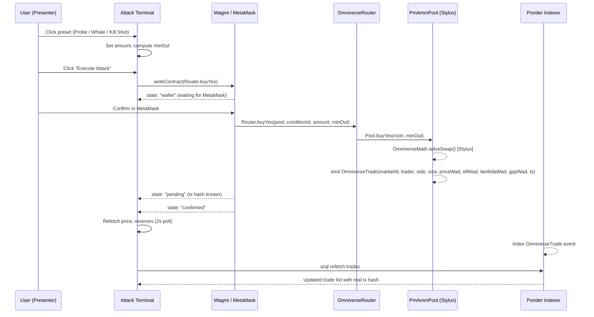
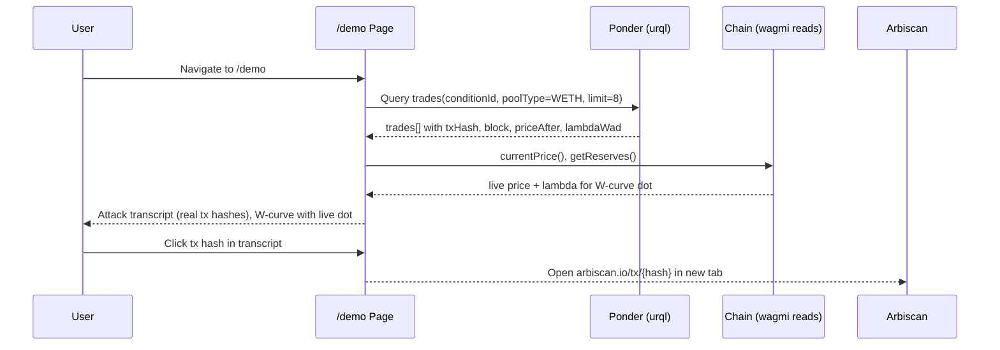

# Design Document: Attack the Pool — Demo Wiring

## Overview

The "Attack the Pool" feature is a full VC-grade live demo for the Omniverse prediction market protocol. It wires together the existing frontend, deployed Arbitrum Sepolia contracts, and Ponder indexer into a cohesive 6-act choreography: landing → live attack terminal → proof dashboard → Arbiscan verification → borrow flow → resolution simulation. Every claim in the demo is backed by a real on-chain read or confirmed transaction — no client-side mocks until the resolution simulation at the very end.

The frontend is a React 19 / Vite / TanStack Router app using wagmi v3, viem, urql (GraphQL to Ponder), and shadcn/ui. All new code must match existing file conventions, reuse the existing hooks and formatters, and avoid introducing new dependencies.

---

## Architecture

```mermaid
graph TD
    subgraph "Demo Data Tier"
        DM["demo-manifest.json\n(frontend/public/)"]
        PONDER["Ponder Indexer\n(GraphQL API)"]
        CHAIN["Arbitrum Sepolia\nContracts"]
    end

    subgraph "Hook Layer (frontend/src/hooks/)"
        H1["useDemoManifest()"]
        H2["useLiveBlockNumber()"]
        H3["usePoolPrice()"]
        H4["usePoolReserves()"]
        H5["useMathKernelStatus()"]
        H6["useDemoTrades() — urql"]
        H7["usePreDemoReadiness()"]
        H8["useTokenAllowance()"]
        H9["useTokenBalance()"]
    end

    subgraph "Pages (frontend/src/routes/)"
        R1["/  — Landing"]
        R2["/markets/:id  — Attack Terminal"]
        R3["/demo  — Proof Dashboard"]
        R4["/simulate  — Resolution Education"]
    end

    subgraph "Components (frontend/src/components/)"
        C1["AttackModeStrip"]
        C2["AttackPresets (Probe/Whale/KillShot)"]
        C3["SwapTab (wired to real Router)"]
        C4["DemoProofDashboard"]
        C5["WCurveLive"]
        C6["LpShieldPanel"]
        C7["AttackTranscript"]
        C8["BorrowDemoTab"]
        C9["PreDemoReadinessPanel"]
        C10["SimulationBanner"]
    end

    DM --> H1
    PONDER --> H6
    CHAIN --> H2 & H3 & H4 & H5 & H8 & H9

    H1 & H2 & H3 & H4 & H5 & H6 --> C1 & C2 & C4 & C5
    H8 & H9 --> C9

    R2 --> C1 & C2 & C3 & C8 & C9
    R3 --> C4 & C5 & C6 & C7
    R4 --> C10
```



---

## Sequence Diagrams

### Act 2-4: Trade Execution State Machine



### Act 5: Proof Dashboard Population



---

## Components and Interfaces

### Component 1: AttackModeStrip

**Purpose**: Persistent header strip shown on `/markets/:id` when the route matches the demo conditionId. Shows live contract reads as a ticker.

**Interface**:
```typescript
interface AttackModeStripProps {
  conditionId?: string;
  pool?: `0x${string}`;
  price?: bigint;             // WAD from currentPrice()
  reserves?: PoolReserves;    // from getReserves()
  liquidity?: bigint;         // from currentLiquidity()
  mathLabel: string;          // "Stylus kernel" | "Fallback math"
  mathMatches: boolean;
  indexed: boolean;
  indexerLoading: boolean;
  latestTx?: string;
}
```

**Responsibilities**:
- Display live P(YES), λ*, active%, passive%, ell, L_t, math badge
- Link pool address to Arbiscan
- Link latest tx hash to Arbiscan

> **Existing**: `AttackModeStrip` is already implemented in `markets.$id.tsx`. No changes needed to the component itself — it receives all props from the parent.

---

### Component 2: AttackPresets

**Purpose**: One-click trade buttons that set amount + execute a buyYes swap through the Router.

**Interface**:
```typescript
interface AttackPresetsProps {
  pool: `0x${string}`;          // poolWeth address from manifest
  conditionId: `0x${string}`;   // from manifest
  yesPrice: number;              // for minOut calculation
  onConfirmed: () => void;       // trigger refetch after confirmation
  disabled?: boolean;
}

type Preset = { label: string; amount: string; description: string };
// Probe: "2000", Whale: "4000", Kill Shot: "6000" (WAD, WETH)
```

**Responsibilities**:
- Render 3 preset buttons (Probe 2k, Whale 4k, Kill Shot 6k)
- Pre-compute `minOut` with 5% slippage tolerance
- Drive the transaction state machine (idle → wallet → pending → confirmed → failed)
- Show gas cost estimate
- Auto-approve WETH if allowance insufficient
- Call `onConfirmed` after success to trigger live data refresh

---

### Component 3: DemoProofDashboard

**Purpose**: `/demo` page content — post-attack proof showing indexed trades, W-curve with live dot, LP shield bar. Replaces the existing fully-simulated feed with indexed + live data.

**Interface**:
```typescript
interface DemoProofDashboardProps {
  conditionId: string;
  poolWeth: `0x${string}`;
  price?: bigint;
  reserves?: PoolReserves;
}
```

**Responsibilities**:
- Render `AttackTranscript` with real tx hashes from urql
- Render `WCurveLive` with current dot position from live price
- Render `LpShieldPanel` with active/passive reserve percentages
- Fall back gracefully when indexer is lagging (show `DataSourceBadge source="unavailable"`)

---

### Component 4: AttackTranscript

**Purpose**: Panel showing the 3 demo trades as an ordered proof table.

**Interface**:
```typescript
interface AttackTranscriptProps {
  trades: DemoTrade[];  // from useDemoTrades()
  isLoading: boolean;
  source: DataSource;
}

type DemoTrade = {
  id: string;
  side: number;         // 0=buyYes
  sideLabel: string;
  size: bigint;
  priceAfter: bigint;
  lambdaWad: bigint;
  ellWad: bigint;
  gapWad: bigint;
  trader: `0x${string}`;
  txHash: string;
  blockNumber: number;
  timestamp: number;
};
```

**Responsibilities**:
- Ordered list: Probe → Whale → Kill Shot (sorted by size ascending, or timestamp)
- Each row: block#, tx hash (links to Arbiscan), size (WETH), P(YES) after, λ after
- Skeleton loaders while indexer fetching
- "Indexed from Ponder" badge

---

### Component 5: WCurveLive

**Purpose**: The W-curve SVG with a live dot showing current pool state.

**Interface**:
```typescript
interface WCurveLiveProps {
  price: number;           // 0..1, from live contract read
  lambdaWad?: bigint;      // current lambda, optional
  source: DataSource;
}
```

**Responsibilities**:
- Render the static W-curve path (λ*(p) function)
- Animate a dot to current price position
- Show current λ* value in corner
- Mark the pre-attack and post-attack probability positions

> **Existing**: `WCurve` in `demo.tsx` renders a static W-curve with a simulated price. Replace `price` from `useSimulatedFeed()` with `price` from `usePoolPrice(manifest.poolWeth)`.

---

### Component 6: LpShieldPanel

**Purpose**: Shows active vs passive reserve split as a stacked bar.

**Interface**:
```typescript
interface LpShieldPanelProps {
  reserves?: PoolReserves;
  source: DataSource;
}
```

**Responsibilities**:
- Compute `activePct = (xActive + yActive) / (xActive + xPassive + yActive + yPassive) * 100`
- Render stacked bar: active (white, bright) / passive (white, dim)
- Show passivePct as the "shielded" percentage
- Animate transitions

---

### Component 7: PreDemoReadinessPanel

**Purpose**: Pre-flight checklist displayed as an expandable panel on the market terminal. Verifies all prerequisites before going live.

**Interface**:
```typescript
interface ReadinessCheck {
  label: string;
  status: "pass" | "fail" | "loading" | "warning";
  detail?: string;
}

interface PreDemoReadinessPanelProps {
  manifest: DemoManifest | null;
  chainId: number;
  walletAddress?: `0x${string}`;
  wethBalance: bigint;
  wethAllowance: bigint;
  poolPrice?: bigint;
  indexerReady: boolean;
  blockNumber?: bigint;
  presentMode?: boolean;    // hide this panel in ?present=true mode
}
```

**Checks to surface**:
1. Chain = Arbitrum Sepolia (421614)
2. Wallet connected
3. WETH balance ≥ 12,000 WAD (covers all 3 trades)
4. WETH allowance on Router ≥ 12,000 WAD (or "Approve Max" button)
5. Pool price readable (not frozen)
6. Ponder indexer synced (indexed market exists)
7. START_BLOCK ≤ createdBlock

---

### Component 8: SimulationBanner

**Purpose**: Prominent banner on `/simulate` clarifying it is a client-side simulation, not an on-chain transaction.

**Interface**:
```typescript
interface SimulationBannerProps {
  className?: string;
}
```

**Responsibilities**:
- Render a static amber/orange banner: "SIMULATION · Client-side only · No on-chain transactions"
- Explain: "Resolving the market live would destroy the demo pool. This shows the mathematical outcome."

---

### Component 9: BorrowDemoTab

**Purpose**: Dedicated borrow UI wired to demo manifest defaults (500 WETH collateral, 250 USDC borrow). Replaces the existing `IntentEngine mode="execute"` tab during demo.

**Interface**:
```typescript
interface BorrowDemoTabProps {
  lending: `0x${string}`;
  conditionId: `0x${string}`;
  wethCollateral?: string;   // default "500"
  usdcBorrow?: string;       // default "250"
  onConfirmed?: () => void;
}
```

**Responsibilities**:
- Pre-fill demo amounts from manifest: `lendingCollateral / 1e18` for collateral
- Show LTV = borrow/collateral, health factor formula explanation
- Execute `Router.executeBorrow(lending, conditionId, wethCollateral, usdcBorrow)`
- Approval flow: `WETH.approve(router, wethCollateral)` (ERC-20) — `executeBorrow` pulls WETH
  collateral and splits internally, so the user approves WETH, not the CTF

---

## Data Models

### DemoManifest (existing — `useDemoManifest.ts`)

```typescript
type DemoManifest = {
  runId: string;
  createdBlock: number;
  question: string;
  symbol: string;
  conditionId: `0x${string}`;
  wethMarketId: string;
  usdcMarketId: string;
  poolWeth: `0x${string}`;
  poolUsdc: `0x${string}`;
  yesWethId: string;
  noWethId: string;
  factory: `0x${string}`;
  resolver: `0x${string}`;
  math: `0x${string}`;
  demoAccount: `0x${string}`;
  weth: `0x${string}`;
  usdc: `0x${string}`;
  l0: string;                   // WAD string, e.g. "500000000000000000000000"
  gammaPrime: string;
  initialLiquidityYes: string;
  initialLiquidityNo: string;
  lending: `0x${string}`;
  lendingSeed: string;
  lendingCollateral: string;    // WAD string for default borrow preset
  lendingDebt: string;
};
```

**Source**: `frontend/public/demo-manifest.json` (copied from `contracts-sol/deployments/demo-manifest.json` by `run-demo-sepolia.sh`)

**Validation Rules**:
- `conditionId` must be a valid bytes32 hex string
- `poolWeth` and `poolUsdc` must be non-zero addresses
- `l0` must parse to a positive BigInt

---

### PoolReserves (existing — `useLiveDemoReads.ts`)

```typescript
type PoolReserves = {
  xActive: bigint;    // YES active (WAD)
  xPassive: bigint;   // YES passive (WAD)
  yActive: bigint;    // NO active (WAD)
  yPassive: bigint;   // NO passive (WAD)
  ellActive: bigint;  // active liquidity parameter ℓ (WAD)
  lambdaWad: bigint;  // current λ fraction (WAD)
  lT: bigint;         // current L_t = L0·√(T-t) (WAD)
};
```

**Source**: `PmAmmPool.getReserves()` — returns 7 values in this order per the ABI.

---

### TxState (new)

```typescript
type TxPhase = "idle" | "wallet" | "pending" | "confirmed" | "failed";

type TxState = {
  phase: TxPhase;
  hash?: `0x${string}`;
  error?: string;
};
```

Used by `AttackPresets` and `BorrowDemoTab` to drive UI feedback.

---

### ReadinessStatus (new)

```typescript
type CheckStatus = "pass" | "fail" | "loading" | "warning";

type ReadinessCheck = {
  label: string;
  status: CheckStatus;
  detail?: string;
  action?: {            // optional inline CTA
    label: string;
    onClick: () => void;
  };
};
```

---

## Algorithmic Pseudocode

### Algorithm 1: Attack Preset Execution

```pascal
ALGORITHM executeAttackPreset(preset, pool, conditionId, yesPrice)
INPUT:
  preset: { label: String, amountWad: BigInt }
  pool: Address
  conditionId: Bytes32
  yesPrice: Float (0..1)
OUTPUT: txState transitions

PRECONDITIONS:
  wethBalance >= preset.amountWad
  wethAllowance(router) >= preset.amountWad
  pool IS NOT frozen (T - now > FREEZE_WINDOW)

BEGIN
  // Step 1: Compute minimum output with 5% slippage
  expectedOut ← (preset.amountWad * WAD) / yesPrice_WAD
  minOut ← expectedOut * 95 / 100    // 5% tolerance

  // Step 2: Check allowance
  IF wethAllowance < preset.amountWad THEN
    setPhase("wallet")
    writeContract(ERC20.approve, router, MAX_UINT256)
    AWAIT confirmation
    ASSERT newAllowance >= preset.amountWad
  END IF

  // Step 3: Execute swap
  setPhase("wallet")
  hash ← writeContract(Router.buyYes, pool, conditionId, preset.amountWad, minOut)
  setPhase("pending", hash)

  // Step 4: Await receipt
  receipt ← waitForTransactionReceipt(hash)

  IF receipt.status = "success" THEN
    setPhase("confirmed")
    triggerRefetch(price, reserves, trades)
  ELSE
    // Parse revert reason: Frozen() | Slippage() | DeadlineExpired()
    error ← decodeRevertReason(receipt)
    setPhase("failed", error)
  END IF
END

POSTCONDITIONS:
  IF confirmed: pool state updated, OmniverseTrade event emitted
  IF failed(Slippage): suggest reducing trade size
  IF failed(Frozen): display "Pool expiry window reached"
```

**Loop Invariants**: N/A (no loops; sequential state machine)

---

### Algorithm 2: Pre-Demo Readiness Evaluation

```pascal
ALGORITHM evaluateReadiness(manifest, walletAddress, blockNumber)
INPUT:
  manifest: DemoManifest | null
  walletAddress: Address | null
  blockNumber: BigInt | null
OUTPUT: checks: ReadinessCheck[]

BEGIN
  checks ← []

  // Check 1: Manifest loaded
  IF manifest IS null THEN
    checks.push({ label: "Demo manifest", status: "fail", detail: "demo-manifest.json not found" })
    RETURN checks   // All subsequent checks need manifest
  END IF

  checks.push({ label: "Demo manifest", status: "pass", detail: manifest.symbol })

  // Check 2: Chain
  IF chainId ≠ 421614 THEN
    checks.push({ label: "Network", status: "fail", detail: "Switch to Arbitrum Sepolia" })
  ELSE
    checks.push({ label: "Network", status: "pass", detail: "Arbitrum Sepolia" })
  END IF

  // Check 3: Wallet
  IF walletAddress IS null THEN
    checks.push({ label: "Wallet", status: "fail", detail: "Connect wallet" })
  ELSE
    checks.push({ label: "Wallet", status: "pass", detail: formatAddress(walletAddress) })
  END IF

  // Check 4: WETH balance (≥ 12,000 WAD)
  REQUIRED_WETH ← 12_000 * WAD
  IF wethBalance < REQUIRED_WETH THEN
    checks.push({ label: "WETH balance", status: "fail", detail: formatWad(wethBalance) + " / 12,000 needed" })
  ELSE
    checks.push({ label: "WETH balance", status: "pass", detail: formatWad(wethBalance) + " WETH" })
  END IF

  // Check 5: WETH allowance on Router
  IF wethAllowance < REQUIRED_WETH THEN
    checks.push({ label: "WETH allowance", status: "warning", detail: "Approve Router for max",
      action: { label: "Approve Max", onClick: approveMaxWeth } })
  ELSE
    checks.push({ label: "WETH allowance", status: "pass" })
  END IF

  // Check 6: Pool price readable
  IF poolPrice IS null THEN
    checks.push({ label: "Pool state", status: "loading" })
  ELSE IF isFrozen(poolPrice, expiry) THEN
    checks.push({ label: "Pool state", status: "fail", detail: "Pool is frozen (near expiry)" })
  ELSE
    checks.push({ label: "Pool state", status: "pass", detail: "P=" + formatProbability(poolPrice) })
  END IF

  // Check 7: Ponder indexer
  IF indexerReady THEN
    checks.push({ label: "Ponder indexer", status: "pass", detail: "Market indexed" })
  ELSE
    checks.push({ label: "Ponder indexer", status: "warning", detail: "Trades may lag by 1 block" })
  END IF

  // Check 8: START_BLOCK safety
  IF blockNumber IS NOT null THEN
    configStartBlock ← getConfigStartBlock()   // from env or ponder.config default
    IF configStartBlock > manifest.createdBlock THEN
      checks.push({ label: "Ponder START_BLOCK", status: "fail",
        detail: "START_BLOCK (" + configStartBlock + ") > createdBlock (" + manifest.createdBlock + ")" })
    ELSE
      checks.push({ label: "Ponder START_BLOCK", status: "pass" })
    END IF
  END IF

  RETURN checks
END

POSTCONDITIONS:
  Length(checks) IN [1..8]
  ALL checks have valid status IN { "pass", "fail", "loading", "warning" }
```

---

### Algorithm 3: Proof Dashboard Data Assembly

```pascal
ALGORITHM assembleDashboardData(manifest, livePrice, liveReserves, indexedTrades)
INPUT:
  manifest: DemoManifest
  livePrice: BigInt | null       (from currentPrice())
  liveReserves: PoolReserves | null (from getReserves())
  indexedTrades: DemoTrade[]     (from Ponder, ordered by size ASC)
OUTPUT: DashboardData

BEGIN
  // Price and lambda — prefer live, fall back to last indexed
  priceSource ← IF livePrice IS NOT null THEN "live" ELSE "indexed"
  displayPrice ← IF livePrice IS NOT null THEN livePrice
                 ELSE (last indexedTrade).priceAfter

  // Reserve split
  IF liveReserves IS NOT null THEN
    activeTotal ← liveReserves.xActive + liveReserves.yActive
    totalReserves ← activeTotal + liveReserves.xPassive + liveReserves.yPassive
    activePct ← IF totalReserves > 0 THEN (activeTotal * 100) / totalReserves ELSE 0
    passivePct ← 100 - activePct
    reserveSource ← "live"
  ELSE
    activePct ← null
    passivePct ← null
    reserveSource ← "unavailable"
  END IF

  // Attack transcript — up to 3 demo trades sorted Probe → Whale → Kill Shot
  // Sort by size ascending (2k, 4k, 6k). Only include buyYes (side=0).
  attackTrades ← indexedTrades
    FILTER side = 0 (buyYes)
    SORT BY size ASC
    TAKE 3

  // W-curve dot position
  priceFloat ← wadToNumber(displayPrice)  // 0..1

  RETURN {
    price: displayPrice,
    priceFloat,
    priceSource,
    activePct,
    passivePct,
    reserveSource,
    lambdaWad: liveReserves?.lambdaWad ?? last(indexedTrades)?.lambdaWad,
    attackTrades,
    allTrades: indexedTrades
  }
END

POSTCONDITIONS:
  0 <= priceFloat <= 1
  activePct + passivePct = 100 (when reserves available)
  Length(attackTrades) <= 3
```

---

## Key Functions with Formal Specifications

### `useAttackPresets(pool, conditionId, yesPrice, onConfirmed)`

```typescript
function useAttackPresets(
  pool: `0x${string}` | undefined,
  conditionId: `0x${string}` | undefined,
  yesPrice: number,
  onConfirmed?: () => void,
): {
  presets: Preset[];
  txState: TxState;
  execute: (preset: Preset) => void;
}
```

**Preconditions:**
- `pool` is a valid non-zero address
- `yesPrice` is in range (0, 1) exclusive

**Postconditions:**
- After `execute(preset)`: `txState.phase` transitions `idle → wallet → pending → confirmed | failed`
- On `confirmed`: `onConfirmed()` is called exactly once
- On `failed(Slippage)`: `txState.error` contains a human-readable message
- On `failed(Frozen)`: `txState.error` = "Pool is frozen — too close to expiry"

---

### `usePreDemoReadiness(manifest, pool)`

```typescript
function usePreDemoReadiness(
  manifest: DemoManifest | null,
  pool: `0x${string}` | undefined,
): {
  checks: ReadinessCheck[];
  allPass: boolean;
  approveMaxWeth: () => void;
}
```

**Preconditions:**
- Called with latest manifest from `useDemoManifest()`
- Pool address from manifest

**Postconditions:**
- `allPass = true` iff all checks have `status = "pass"`
- `approveMaxWeth()` triggers `ERC20.approve(router, MAX_UINT256)` write

---

### `assembleDashboardData(manifest, livePrice, liveReserves, trades)`

```typescript
function assembleDashboardData(
  manifest: DemoManifest,
  livePrice: bigint | undefined,
  liveReserves: PoolReserves | undefined,
  trades: DemoTrade[],
): DashboardData
```

**Preconditions:**
- `manifest` is non-null

**Postconditions:**
- `data.priceFloat ∈ [0, 1]`
- `data.activePct + data.passivePct = 100` when reserves available
- `data.attackTrades.length ≤ 3`
- All trade entries in `attackTrades` have valid `txHash` for Arbiscan links

---

## Example Usage

### Wiring the Demo Market Route

```typescript
// In /markets/:id route, after isDemoMarket is determined:
const manifest = useDemoManifest().data;
const { price } = usePoolPrice(manifest?.poolWeth);
const { reserves } = usePoolReserves(manifest?.poolWeth);
const { trades, refetch: refetchTrades } = useDemoTrades(manifest?.conditionId, "WETH");

// Attack presets wired into SwapTab when isDemoMarket
const { presets, txState, execute } = useAttackPresets(
  manifest?.poolWeth,
  manifest?.conditionId,
  price ? Number(price) / 1e18 : 0.5,
  () => { refetchTrades(); },
);
```

### Wiring the Proof Dashboard

```typescript
// In /demo route, replacing useSimulatedFeed():
const { data: manifest } = useDemoManifest();
const { price } = usePoolPrice(manifest?.poolWeth);
const { reserves } = usePoolReserves(manifest?.poolWeth);
const { trades } = useDemoTrades(manifest?.conditionId, "WETH");

const dashboard = assembleDashboardData(manifest!, price, reserves, trades);
// Pass dashboard.priceFloat into WCurveLive
// Pass dashboard.attackTrades into AttackTranscript
// Pass dashboard.activePct, passivePct into LpShieldPanel
```

### Presentation Mode (`?present=true`)

```typescript
// In root layout or any route:
const { search } = useSearch({ strict: false });
const presentMode = (search as Record<string, string>).present === "true";

// Hide readiness panel, hide dev badges, full-screen the demo
if (presentMode) {
  // CSS class: .present-mode hides debug panels, enlarges key metrics
}
```

---

## Correctness Properties

*A property is a characteristic or behavior that should hold true across all valid executions of a system — essentially, a formal statement about what the system should do. Properties serve as the bridge between human-readable specifications and machine-verifiable correctness guarantees.*

### Property 1: Live Data Precedence

For any call to `assembleDashboardData` where `livePrice` is defined (not `undefined`), the returned `displayPrice` must equal `livePrice`, never the last indexed trade's `priceAfter`.

**Validates: Requirement 9.4**

### Property 2: Tx Hash Authenticity

For any trade row rendered by `AttackTranscript`, the displayed `txHash` must equal the value from the Ponder `DemoTrade.txHash` field returned by `useDemoTrades` — it must never be a client-fabricated value.

**Validates: Requirement 7.2**

### Property 3: Slippage Safety

For any `yesPrice ∈ (0, 1)` and any preset `amountWad > 0`, the computed `minOut` must satisfy `minOut ≤ floor(expectedOut × 0.95)` where `expectedOut = (amountWad × 1e18) / yesPriceWad`.

**Validates: Requirement 3.2**

### Property 4: Demo Mode Isolation

For any market page where `isDemoMarket = false`, none of `AttackPresets`, `PreDemoReadinessPanel`, or `BorrowDemoTab` may appear in the rendered output.

**Validates: Requirements 4.1, 4.2, 4.3, 4.4**

### Property 5: Simulation Transparency

The `SimulationBanner` component must always be present in the rendered output of the `/simulate` route, regardless of `presentMode` state or any other route parameter.

**Validates: Requirements 12.1, 12.3**

### Property 6: Source Badge Accuracy

For any numeric value rendered in the UI, the accompanying `DataSourceBadge` source attribute must equal the actual origin of that value: `"live"` for wagmi reads, `"indexed"` for Ponder/urql, `"manifest"` for direct manifest reads, `"computed"` for derived values, `"unavailable"` when the source is unreachable.

**Validates: Requirements 13.1, 13.2, 13.3, 13.4, 13.5**

### Property 7: Dashboard Price Float Bounds

For any `livePrice ∈ [0n, 10^18n]`, the `priceFloat` returned by `assembleDashboardData` must satisfy `0.0 ≤ priceFloat ≤ 1.0`.

**Validates: Requirement 9.1**

### Property 8: Reserve Percentage Invariant

For any `PoolReserves` where `(xActive + xPassive + yActive + yPassive) > 0n`, `activePct + passivePct` must equal `100`.

**Validates: Requirements 9.2, 10.1**

### Property 9: Attack Trades Slice Bound

For any indexed trade list of arbitrary length, `assembleDashboardData` must return `attackTrades` with at most 3 entries, all with `side = 0`, sorted ascending by size.

**Validates: Requirement 9.3**

### Property 10: Formatter Safety

For any `price ∈ [0n, 10^18n]`, `formatProbability(price)` returns a string ending in `%` with a numeric prefix in `[0, 100]`; for any non-negative WAD `BigInt`, `formatWad` returns without throwing; for any tx hash string, `arbiscanTxUrl` returns the correct Arbiscan URL prefix.

**Validates: Requirements 14.1, 14.2, 14.3**

### Property 11: Readiness allPass Consistency

For any array of `ReadinessCheck` objects, `allPass` must be `true` if and only if every check in the array has `status = "pass"`.

**Validates: Requirement 5.2**

### Property 12: Borrow Tab Pre-fill Accuracy

For any `DemoManifest`, `BorrowDemoTab` must pre-fill collateral as `manifest.lendingCollateral / 1e18` and borrow as `manifest.lendingDebt / 1e18`, with no precision loss beyond standard floating-point truncation.

**Validates: Requirement 11.1**

---

## Error Handling

### Scenario 1: Pool Frozen (`Frozen()` revert)

**Condition**: Swap attempted within `FREEZE_WINDOW` seconds of expiry `T`  
**Response**: Catch revert, decode `Frozen()` selector, set `txState.phase = "failed"`, display:  
`"Pool is frozen — too close to expiry. Contact team to extend T or deploy new pool."`  
**Recovery**: Manual intervention; block all preset buttons

### Scenario 2: Slippage (`Slippage()` revert)

**Condition**: Price moved between simulation and execution; `out < minOut`  
**Response**: Catch revert, decode `Slippage()` selector, display:  
`"Price moved before your trade landed. Try the next preset size."`  
**Recovery**: Auto-suggest smaller trade; reduce `minOut` to 90% for retry

### Scenario 3: Ponder Indexer Lag

**Condition**: `useDemoTrades()` returns empty or stale results after confirmed tx  
**Response**: Show `DataSourceBadge source="unavailable"` on the trades panel; show skeletons  
**Recovery**: `refetch()` with a 3s retry loop (max 5 attempts); display tx hash from wagmi receipt as fallback proof

### Scenario 4: MetaMask Slow / User Abandons

**Condition**: User closes MetaMask without confirming; `txHash` never received  
**Response**: `txState.phase` remains `"wallet"` until user interaction or 60s timeout; show "Waiting for wallet..." with a cancel option  
**Recovery**: `txState.phase → "idle"` on cancel; no state mutation to pool assumed

### Scenario 5: RPC Failure

**Condition**: `wagmi useReadContract` returns error (network outage, rate limit)  
**Response**: Show `DataSourceBadge source="unavailable"` for affected metrics; last known values persist with a stale indicator  
**Recovery**: wagmi's built-in retry with `refetchInterval: 2000`

### Scenario 6: Manifest Missing

**Condition**: `fetch("/demo-manifest.json")` returns 404  
**Response**: `isDemoMarket = false` everywhere; no attack mode strip shown; market page behaves as standard non-demo market  
**Recovery**: Re-run `run-demo-sepolia.sh` to regenerate manifest

---

## Testing Strategy

### Unit Testing Approach

Test pure utility functions and data assembly in isolation:

- `assembleDashboardData()`: Property tests with arbitrary livePrice/reserves/trades combinations
- `evaluateReadiness()`: Table-driven tests for each of the 8 checks (pass/fail/warn matrix)
- `formatWad`, `formatProbability`, `arbiscanTxUrl`: Existing formatter tests in `lib/formatters.ts`

**Test runner**: Vitest (already in the project via `@vitejs/plugin-react`)

### Property-Based Testing Approach

**Property Test Library**: Vitest + fast-check

Key properties to verify:
- For all `price ∈ [0n, 1e18n]`, `formatProbability(price)` returns a string ending in `%` within `[0%, 100%]`
- For all `reserves` where `xActive + xPassive + yActive + yPassive > 0n`, `activePct + passivePct = 100`
- `minOut ≤ expectedOut` always holds (slippage bound respected)

### Integration Testing Approach

Manual E2E rehearsal checklist (captured in `run-demo-sepolia.sh`):
1. Fresh pool at P≈0.50 — verify `currentPrice()` read displays correctly
2. Probe trade (2000 WETH) — verify tx confirms, price updates, lambda drops
3. Whale trade (4000 WETH) — verify transcript shows 2 trades with real hashes
4. Kill Shot (6000 WETH) — verify passive% > 80%
5. Navigate to `/demo` — verify W-curve dot at P≈0.93, 3 trades in transcript
6. Click tx hash → Arbiscan opens correct transaction
7. Navigate to `/markets/:id` → Borrow tab → execute borrow
8. Navigate to `/simulate` → verify SimulationBanner visible → trigger resolution

---

## Performance Considerations

- **Poll interval**: wagmi reads use `refetchInterval: 2000` (2s). With 3 concurrent reads per market (price, reserves, liquidity), this is 3 RPC calls per 2s — acceptable for testnet.
- **urql caching**: Ponder GraphQL responses are cached with `requestPolicy: "cache-and-network"`. After a trade confirms, use `network-only` to force fresh data.
- **Manifest fetch**: Fetched once on mount with `cache: "no-store"`. ~300 bytes, negligible cost.
- **W-curve SVG**: Static path computed once via `useMemo`. Only the dot position animates via Framer Motion.
- **No new dependencies**: All components use existing wagmi, urql, motion, shadcn/ui, lucide-react.

---

## Security Considerations

- **minOut slippage protection**: Always compute `minOut = expectedOut × 0.95` before submitting. Never use `0n` as minOut in production demo (exposes to sandwich).
- **MAX_UINT256 approval scope**: The "Approve Max" button in the readiness panel approves the Router contract (deployed, audited path). Shown only as an opt-in action.
- **No private key exposure**: The demo account address is public in the manifest. Private key lives only in `.env` / Foundry script environment.
- **Tx hash display**: Only tx hashes sourced from Ponder (indexed from chain) or wagmi's `useWaitForTransactionReceipt` result are displayed. No client-fabricated hashes.

---

## Dependencies

All dependencies are already installed in `frontend/package.json`:

| Dependency | Version | Use |
|-----------|---------|-----|
| `wagmi` | ^3.6.16 | Contract reads, writes, wallet connection |
| `viem` | 2.x | BigInt parsing, ABI encoding |
| `urql` | ^5.0.2 | GraphQL queries to Ponder |
| `motion` | ^12.40.0 | W-curve dot animation, tx state transitions |
| `@tanstack/react-router` | ^1.168.25 | `?present=true` search param |
| `sonner` | ^2.0.7 | Toast notifications for tx lifecycle |
| `lucide-react` | ^0.575.0 | Icons for readiness checks |

**New files to create** (no new npm packages required):

```
frontend/src/components/attack-presets.tsx
frontend/src/components/borrow-demo-tab.tsx
frontend/src/components/pre-demo-readiness-panel.tsx
frontend/src/components/simulation-banner.tsx
frontend/src/components/attack-transcript.tsx
frontend/src/components/lp-shield-panel.tsx
frontend/src/components/w-curve-live.tsx
frontend/src/hooks/useAttackPresets.ts
frontend/src/hooks/usePreDemoReadiness.ts
frontend/src/lib/dashboardData.ts
```

**Files to modify**:

```
frontend/src/routes/demo.tsx          — replace simulated feed with live data
frontend/src/routes/markets.$id.tsx   — add AttackPresets to SwapTab, add BorrowDemoTab
frontend/src/routes/simulate.tsx      — add SimulationBanner
frontend/public/demo-manifest.json   — keep in sync with contracts-sol/deployments/demo-manifest.json
```

---

## Phase Implementation Order

### Phase 1 — Data Foundation (Day 1 morning)
Verify all existing hooks return correct data from the deployed contracts. Add `usePreDemoReadiness`. Sync `demo-manifest.json`.

**Success criteria**: `PreDemoReadinessPanel` shows all-green on a properly configured dev machine.

### Phase 2 — Attack Surface (Day 1 afternoon)
Build `AttackPresets` component and `useAttackPresets` hook. Wire into SwapTab when `isDemoMarket`. Verify all 3 presets execute and UI reflects confirmed state.

**Success criteria**: Probe (2000 WETH) trade executes end-to-end; toast confirms; price updates within 2s.

### Phase 3 — Proof Dashboard (Day 1 evening)
Replace `useSimulatedFeed` in `demo.tsx` with live data. Wire `AttackTranscript`, `WCurveLive`, `LpShieldPanel`.

**Success criteria**: After Phase 2 trades, `/demo` shows 3 real tx hashes and W-curve dot at correct position.

### Phase 4 — Borrow Flow (Day 2 morning)
Build `BorrowDemoTab`. Wire into `/markets/:id` borrow tab with demo defaults. Verify `executeBorrow` fires correctly.

**Success criteria**: Demo borrow of 250 USDC against 500 YES-WETH executes and position shows in ManageTab.

### Phase 5 — Polish and Rehearsal (Day 2 afternoon)
Add `SimulationBanner` to `/simulate`. Add `?present=true` mode. Run full 6-act rehearsal against Arbitrum Sepolia.

**Success criteria**: Full 6-act choreography completes in ≤ 6:15 with no unexpected errors.
