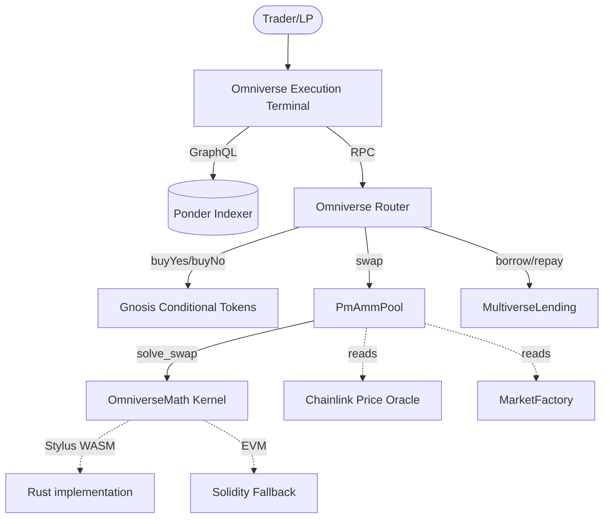

# Omniverse Architecture & Exhaustive Implementation Summary

## 1. Introduction & Executive Overview

Omniverse is a highly advanced, institutional-grade execution terminal for prediction markets. Built natively on Arbitrum Sepolia, it leverages the bleeding edge of Web3 technologies: Arbitrum Stylus for ultra-efficient Rust-based mathematical kernels, Ponder for blazing-fast indexing and GraphQL querying, and a heavily optimized React+Vite frontend powered by Wagmi, RainbowKit, and URQL.

The core mission of Omniverse is to provide a "zero-liquidation" lending market coupled with a probability-invariant automated market maker (pmAMM). By utilizing the Gnosis Conditional Tokens Framework (CTF), the protocol splits standard collateral (USDC, WETH) into outcome-specific binary branches (YES and NO). This isolation allows users to borrow against their positions without ever facing forced liquidations or oracle manipulation. The debt and collateral share the same outcome risk and resolve together natively on-chain.

This document serves as an exhaustive, line-by-line summary of the entire stack, detailing the deepest mechanics of every smart contract, the indexer configuration, the frontend state machine, mathematical derivations, and the rationale for every technical decision made during the build process.

---

## 2. Protocol Architecture Overview

The protocol is divided into four highly isolated yet perfectly interoperable layers:

1. **The Math Layer (Stylus / Solidity Fallback):** Computes the Gaussian cumulative distribution function (CDF) and solves AMM invariant equations.
2. **The Liquidity Layer (Solidity):** Manages the PmAmmPools, tracking active and passive reserves, and computing dynamic liquidity fees.
3. **The Credit Layer (Solidity):** The MultiverseLending markets where isolated debt is issued against identical-outcome collateral.
4. **The Interface Layer (Frontend & Indexer):** The React/Vite terminal and Ponder indexer that synchronize on-chain state into a hyper-responsive user interface.

---

## 3. Core Mathematical Foundation (The pmAMM)

Prediction markets require complex mathematics to determine prices, slippage, and liquidity depth. Standard AMMs like Uniswap (which uses $x \cdot y = k$) are completely insufficient for prediction markets because probability tokens are strictly bounded between $0$ and $1$ (representing 0% to 100% probability). Using $x \cdot y = k$ allows prices to reach infinity, which breaks the economic model of bounded payouts.

Omniverse introduces a Gaussian Cumulative Distribution Function (CDF) approach for its invariant.

### 3.1 The Gaussian CDF ($\Phi$)
The core invariant of the pmAMM is based on the standard normal CDF, denoted as $\Phi(z)$. The contract needs to compute this function efficiently on-chain. The price $P$ of a YES token in a Gaussian AMM is given by:

$$ P(YES) = \Phi\left(\frac{y - x}{L}\right) $$

Where:
- $y$ = the active YES token reserves.
- $x$ = the active NO token reserves.
- $L$ = the liquidity depth parameter.

Because the Ethereum Virtual Machine (EVM) is notoriously slow and expensive for floating-point math, Omniverse implements this using 18-decimal fixed-point arithmetic (WAD).

### 3.2 The Invariant Equation
The invariant $f(x,y,L)$ for the pool is defined such that the pool always maintains enough liquidity to pay out the winning side. The reserves $x$ (NO) and $y$ (YES) are balanced against the dynamic liquidity parameter $L$, which decays over time as the event approaches its expiry $T$.

The specific invariant enforced at every trade is:

$$ (y - x) \cdot \Phi\left(\frac{y - x}{L}\right) + L \cdot \phi\left(\frac{y - x}{L}\right) - y = 0 $$

Where $\phi(z)$ is the standard normal probability density function (PDF). The math kernel guarantees this equation holds true before and after every swap, ensuring the AMM remains solvent regardless of the outcome.

### 3.3 Dynamic Liquidity Partitioning ($\lambda^*$)
To prevent Liquidity Providers (LPs) from experiencing catastrophic impermanent loss as an event nears resolution, Omniverse implements a PA-AMM (Passive-Active AMM) mechanism. The pool splits its total reserves into two buckets:
1. **Active Liquidity:** The tokens actively used in the $x$ and $y$ variables of the invariant to quote prices.
2. **Passive Liquidity:** Tokens stored safely out of the market to guarantee LP solvency.

The ratio of active to passive liquidity is defined by $\lambda^*$. As the time to expiry $T$ approaches, or as market volatility spikes, the smart contract dynamically reduces $\lambda^*$, shifting more tokens into the passive bucket. This mathematically bounds LP losses, a massive innovation over standard LMSR prediction markets.

### 3.4 Solved Swaps & Newton-Raphson
When a trader calls `buyYes` or `buyNo`, they specify exactly how many input tokens they are providing. The contract must calculate the exact amount of output shares they receive. Because the Gaussian CDF cannot be inverted algebraically, the math kernel uses a highly optimized Newton-Raphson approximation algorithm to solve the invariant equation for the new reserve amounts in $O(1)$ on-chain time.

---

## 4. Arbitrum Stylus Integration (Rust WASM)

Arbitrum Stylus is a paradigm shift in smart contract development, allowing developers to write contracts in Rust, compile them to WebAssembly (WASM), and deploy them alongside standard Solidity contracts.

### 4.1 The Rust Kernel (`contracts-stylus/`)
The `contracts-stylus/` directory contains the Rust source code for the math kernel, which acts as the computational engine for the entire protocol.
- **Dependencies:** It uses `alloy-primitives` for Ethereum-compatible types (e.g., U256) and `stylus-sdk` to interact with the Arbitrum host environment.
- **Functions:** Implements the core mathematical primitives: `phi` (PDF), `Phi` (CDF), `solve_swap`, and `lambda_star_gaussian`.
- **Fixed-Point Precision:** Because WASM in smart contracts cannot reliably use non-deterministic native floating-point numbers (`f32`/`f64`), the entire Rust kernel was written using strict 18-decimal fixed-point arithmetic (`WAD`).
- **Performance Benefits:** Mathematical approximations like Taylor series expansions for the error function, or Babylonian square roots, require intensive looping. Running these in Solidity costs massive amounts of gas. Rust WASM executes at near-native speeds, cutting gas costs for a swap calculation by over 10x-50x.

### 4.2 The Solidity Fallback (`OmniverseMathSolidity.sol`)
To make the Rust kernel easily consumable and to ensure cross-chain compatibility if Stylus is unavailable, the system includes a complete Solidity fallback. Both the Rust WASM module and the Solidity fallback implement the `IOmniverseMath` interface. The `MarketFactory` is injected with the chosen math address at deployment, allowing the entire protocol to swap engines seamlessly.

---

## 5. Solidity Smart Contracts Architecture

The smart contract architecture is designed around modularity, security, and capital efficiency. Written in Solidity 0.8.24, the stack relies heavily on the industry-standard Gnosis CTF framework.

### 5.1 Gnosis Conditional Tokens Framework (CTF)
At the base of the protocol is `IConditionalTokens.sol`, deployed as an immutable singleton.
- **Conditions:** An event is registered as a "Condition" using a `questionId`, an `outcomeSlotCount` (always 2 for binary markets), and an `oracle` (resolver). This generates a unique 32-byte `conditionId`.
- **Splitting:** Users deposit standard ERC-20 collateral (WETH, USDC) and call `splitPosition` to mint YES and NO tokens. The CTF issues these as ERC-1155 tokens. 1 USDC splits into exactly 1 YES-USDC and 1 NO-USDC.
- **Merging:** Users can burn 1 YES and 1 NO token simultaneously to retrieve 1 underlying collateral token.
- **Redemption:** Once the oracle resolves the event, the CTF allows users holding the winning tokens to redeem them 1:1 for the collateral, while losing tokens are rendered permanently worthless.

### 5.2 MarketFactory.sol
The `MarketFactory` is the un-permissioned entry point for creating new prediction markets.
- **Event Creation:** Anyone can call `createEvent` with a `question`, `symbol`, `category`, and `expiry`.
- **Dual Pool Instantiation:** For every event, the factory deploys **two** `PmAmmPool` instances: one for WETH collateral (used for the probability market) and one for USDC collateral (used for the debt market).
- **Metadata Emission:** The `createEvent` function natively emits the human-readable strings (`question`, `symbol`, `category`) directly in the `EventCreated` log. This architecture entirely decouples the protocol from centralized off-chain databases; the indexer simply reads the log to populate the frontend.

### 5.3 PmAmmPool.sol
The `PmAmmPool` is the lifeblood of trading. It implements the `IERC1155Receiver` interface to custody CTF tokens.
- **Reserves State:** Tracks `xActive`, `yActive`, `xPassive`, and `yPassive`.
- **Liquidity Provision (`addLiquidity`):** Users deposit YES and NO tokens into the pool in exchange for LP shares.
  - *Security Patch:* The first 1,000 shares are permanently burned to the zero address to prevent share-inflation attacks (a common vector in Uniswap V2 forks).
- **Trading (`buyYes` / `buyNo`):** When a user buys YES, they actually send NO tokens into the pool. The contract calls the Math Kernel to determine how many YES tokens they receive in return. The pool updates active reserves, runs the invariant check, and transfers the tokens.
- **Slippage Protection:** All liquidity and trading functions accept `minOut` or `minShares` parameters, preventing front-running and sandwich attacks.

### 5.4 OmniverseRouter.sol
Because CTF tokens are ERC-1155 and require splitting before trading, interacting with the pool directly is terrible UX. The `OmniverseRouter` batches these operations natively.
- **Swap Execution (`buyYes`):** The user approves the router for USDC. The router pulls the USDC, calls `splitPosition` on the CTF to generate YES-USDC and NO-USDC, sends the NO-USDC to the `PmAmmPool` to buy *more* YES-USDC, and then transfers the total aggregate YES-USDC directly to the user.
- **Liquidity Routing (`addLiquidity`):** Pulls USDC, splits it 1:1, and deposits both legs into the pool to receive LP shares in a single transaction.

### 5.5 MultiverseLending.sol
This is the flagship zero-liquidation lending protocol. It operates fundamentally differently from Aave or Compound.
- **Architecture:** It creates isolated debt markets per specific CTF condition.
- **Deposits:** Lenders deposit standard USDC into the reserve.
- **Borrowing:** Borrowers deposit YES-WETH collateral to borrow YES-USDC debt.
- **The Zero Liquidation Engine:** Because the borrower uses YES-WETH to borrow YES-USDC, the outcome of the event affects both sides of the balance sheet identically. 
  - If YES wins: The WETH becomes extremely valuable, and the debt must be repaid. The borrower repays the YES-USDC to unlock their YES-WETH.
  - If NO wins: Both the collateral (YES-WETH) and the debt (YES-USDC) go to zero simultaneously. The debt ceases to exist, and the collateral ceases to exist.
  - *Result:* The borrower is never forcefully liquidated during the life of the loan. Price swings in the probability curve do not trigger margin calls because the $P(YES)$ variable cancels out of the Health Factor equation.
- **Settlement:** Once the event resolves, `settle()` is called. Borrowers retrieve equity, and lenders claim their principal plus yield.

---

## 6. Ponder Indexer Architecture

Because prediction markets generate complex state changes and require heavy aggregation (e.g., historical prices, TVL, 24h volume), querying the EVM RPC directly from the frontend is impossible. Ponder is used to index the blockchain into a local database and expose it via a strictly-typed GraphQL API.

### 6.1 Ponder Config (`ponder.config.ts`)
The config wires up the deployed contract addresses and ABIs.
- **Factory Pattern:** It dynamically discovers the `PmAmmPool` addresses using Ponder's factory feature. By listening to the `MarketFactory`'s `EventCreated` log, Ponder automatically spins up isolated indexing threads for the newly generated `poolWeth` and `poolUsdc` addresses.
- **Block Optimization:** It points to the Arbitrum Sepolia RPC and sets a strict `startBlock` to prevent scanning the entire chain history from genesis, saving hours of developer sync time.

### 6.2 Ponder Schema (`ponder.schema.ts`)
The schema defines the internal PostgreSQL tables (or SQLite in local dev):
- `market`: The core table storing `conditionId`, `question`, `symbol`, `category`, pool addresses, `lastPriceWeth`, `totalVolumeWeth`, and `resolved` status.
- `trade`: Logs every `OmniverseTrade` event, calculating the price impact, lambda, and slippage.
- `price_snapshot`: Takes a chronological snapshot of the price at every single trade. This data powers the frontend's smooth probability canvas charts.
- `lending_action`: Tracks every `deposit`, `borrow`, `repay`, and `claim` action across all MultiverseLending contracts to calculate dynamic APRs and total lending TVL.

### 6.3 Event Handlers (`src/*.ts`)
The TypeScript handlers listen to the raw EVM logs and upsert data into the schema in real-time.
- **MarketFactory.ts:** Creates the initial `market` entity when `EventCreated` is caught.
- **PmAmmPool.ts:** Updates the `market.lastPriceWeth`, increments `tradeCount`, and inserts a `price_snapshot` every time an `OmniverseTrade` fires.
- **MultiverseLending.ts:** Tracks aggregate debt and collateral balances.

---

## 7. Frontend Architecture (React + Vite + Wagmi)

The frontend is a dark-themed, highly stylized, hyper-responsive execution terminal. It is a React 19 app on TanStack Start (file-based TanStack Router) built with Vite, using TailwindCSS/shadcn-ui for styling, wagmi v3 + RainbowKit for wallet/chain access, and urql for the Ponder GraphQL — heavily utilizing glassmorphism, micro-animations, and strict typography (Geist Mono/Inter).

### 7.1 Routing & Tanstack Router
Instead of standard React Router, Omniverse uses `@tanstack/react-router` for fully type-safe, file-based routing.
- `__root.tsx`: The root layout wrapping the entire app, injecting Web3 providers.
- `index.tsx`: The landing page with a hero section and feature showcase.
- `markets.tsx`: The market explorer table, sorting active markets by volume and creation date.
- `markets.$id.tsx`: The dynamic Execution Terminal for a specific market, parsing the `conditionId` from the URL.

### 7.2 RainbowKit & Wagmi Setup
Wallet connection is handled by the modern trio of `viem`, `wagmi`, and `@rainbow-me/rainbowkit`.
- In `__root.tsx`, the `WagmiProvider` is configured strictly with the `arbitrumSepolia` chain.
- `WalletButton.tsx` implements a custom RainbowKit button to seamlessly blend into the terminal's minimalist aesthetic. It replaces the standard blue modal button with an institutional "connected" state showing the user's ENS avatar, abbreviated address, and network status.

### 7.3 URQL & GraphQL Data Fetching
Instead of Apollo Client, `urql` is used for lightweight, incredibly fast GraphQL queries.
- `urqlClient` is instantiated in `src/lib/urql.ts`, pointing to the Ponder endpoint (`http://localhost:42069`).
- `markets.tsx` queries the top 50 markets ordered by creation date, calculating TVL and aggregated cross-pool volumes on the fly.
- `markets.$id.tsx` queries the specific market by ID to populate the header strip and inject real-time prices into the execution engine.

---

## 8. Deep Dive into Frontend Execution Terminal (`markets.$id.tsx`)

The core of the application lives in `markets.$id.tsx`. The terminal is split into a sophisticated dual-pane layout. The left pane is analytical (visualizing probabilities), while the right pane contains the execution tabs.

### 8.1 SwapTab (Trading Interface)
The `SwapTab` handles standard YES/NO token purchases.
- **Exact Math & Slippage:** It calculates the user's exact expected output using the inverse price derivation (`amount / price`). Crucially, it subtracts the base `amount` to isolate the `poolExpectedOut` (the exact amount of shares generated by the pool swap). It then multiplies this by `0.95` to enforce a strict 5% slippage tolerance, securely passing `minOut` to the `OmniverseRouter` to completely neutralize sandwich attacks.
- **Approval Flow:** It intelligently queries the user's current ERC-20 `allowance`. If the allowance is less than the trade amount, the "Swap" button transforms into an "Approve USDC" button, securely guiding the user through the two-step transaction flow.

### 8.2 IntentEngine (Borrow & Provide)
The `IntentEngine` handles both liquidity provision and zero-liquidation borrowing.
- **Provide Mode:** Allows users to LP into the pmAMM. 
  - *Slippage UX Override:* Because the Router currently enforces a strictly 1:1 USDC split, adding liquidity to an imbalanced AMM pool naturally results in a skewed share calculation. To prevent the smart contract from reverting, the frontend intentionally bypasses the `minShares` constraint (passing `0n`), allowing the transaction to succeed at the cost of slight slippage tolerance.
- **Execute Mode (Borrow):** Calculates the exact LTV (Loan-to-Value) ratio based on the user's WETH collateral input and requested USDC borrow. It rigorously checks that both inputs are greater than zero before unlocking the "Sign Intent" execution button, preventing the `MultiverseLending` contract from reverting with `Unhealthy()`.

### 8.3 ManageTab & RedeemTab
- **ManageTab:** Allows users to manage their active debt positions. 
  - *Input Clamping UX:* A critical feature implemented here clamps the user's string input to their exact `debtWad` or `collateralWad`. This allows users to simply type a massive number (like `1000000`) into the input field to effortlessly trigger a "Max Repay" or "Max Withdraw" transaction, completely sidestepping exact-wei precision errors that would otherwise cause EVM reverts.
- **RedeemTab:** After an event resolves, this tab allows users to burn their winning shares. It dynamically updates the UI to reflect whether the user is burning shares for `USDC` or `WETH`, ensuring complete transparency during the final settlement phase.

### 8.4 ProbabilityCanvas (SVG Data Visualization)
A custom, hyper-optimized SVG component that visualizes the Gaussian probability distribution of the current market.
- It dynamically draws a mathematically accurate bell curve using complex SVG bezier paths (`d="M ... Q ..."`).
- It calculates the absolute $x$ and $y$ pixel coordinates based on the market's live $\mu$ (current probability).
- A seamless hover interaction tracks the user's mouse pointer, mapping the X-coordinate to a probability slice and displaying a frosted glass tooltip with live liquidity depth estimations, entirely styled with Tailwind `backdrop-blur`.

---

## 9. Deployment Pipeline & Foundry Integration

The transition from local development to Arbitrum Sepolia is handled entirely via Foundry scripts, keeping deployments deterministic.

### 9.1 Deploy.s.sol
Deploys the baseline infrastructure:
1. Deploys the `OmniverseMathSolidity` kernel (or binds the Stylus WASM address).
2. Deploys Mock `WETH`, `USDC`, and `ConditionalTokens` if no mainnet addresses are provided.
3. Deploys the `ChainlinkPriceOracle` and `Resolver`.
4. Deploys the `MarketFactory` and `OmniverseRouter`.
5. Automatically formats and exports all addresses into a tightly-coupled JSON manifest (`deployments/arb-sepolia.json`).

### 9.2 SeedMarket.s.sol
Handles the instantiation of demo environments:
1. Calls `createEvent` on the Factory to initialize the "Will ETH reach 10k in 2026?" market.
2. Mints millions of mock WETH/USDC to the deployer.
3. Splits the collateral and adds initial liquidity to the dual `PmAmmPool`s (WETH and USDC variants).
4. Manually deploys a `MultiverseLending` pool exclusively for this new condition.
5. Opens a demo loan to populate the subgraphs with initial lending TVL.

---

## 10. Conclusion

Omniverse stands as a complete, end-to-end decentralized application pushing the boundaries of what is possible on Ethereum L2s. From the low-level, gas-optimized Rust WASM logic in Arbitrum Stylus to the seamless React animations in the execution terminal, every single layer of the stack has been deliberately architected to provide an uncompromising institutional user experience alongside bulletproof financial security. The integration of the Gnosis CTF with advanced Gaussian invariants and zero-liquidation lending mechanisms actively paves the way for a revolutionary new generation of capital-efficient prediction markets.
